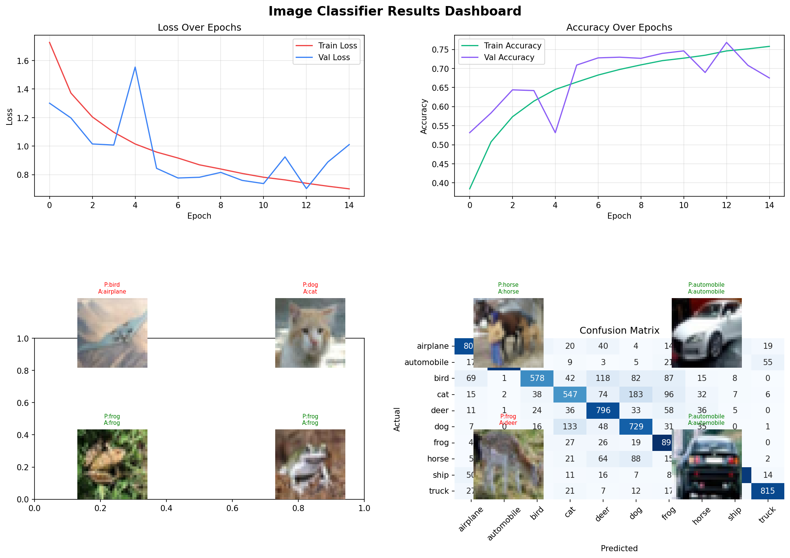

# 🖼️ Image Classifier (CNN)

> CNN image classifier trained on CIFAR-10 dataset achieving 77% accuracy.

## What it does
- Classifies images into 10 categories
- Airplane, car, bird, cat, deer, dog, frog, horse, ship, truck
- Professional results dashboard with confusion matrix
- Training curves showing model improvement over epochs

## Technologies used
- Python 3.11
- TensorFlow & Keras
- NumPy, Matplotlib, Seaborn
- Scikit-learn
- Google Colab (T4 GPU)

## Model Architecture
- 3 Convolutional blocks with BatchNormalization
- MaxPooling and Dropout for regularisation
- EarlyStopping and ReduceLROnPlateau callbacks
- Softmax output layer for 10-class classification

## Results
- Validation accuracy: *77%*
- Best performing classes: Automobile (90%), Ship (90%)
- Trained on 50,000 images, tested on 10,000

## How to run
1. Open image_classifier.ipynb in Google Colab
2. Change runtime to T4 GPU
3. Run all cells in order
4. Training takes approximately 10-15 minutes

## What I learned
- CNN architecture design
- Batch normalisation and dropout for regularisation
- Training callbacks for optimised learning
- Confusion matrix interpretation

## Author
Floraugo | AI & Adaptive Analytics Student
